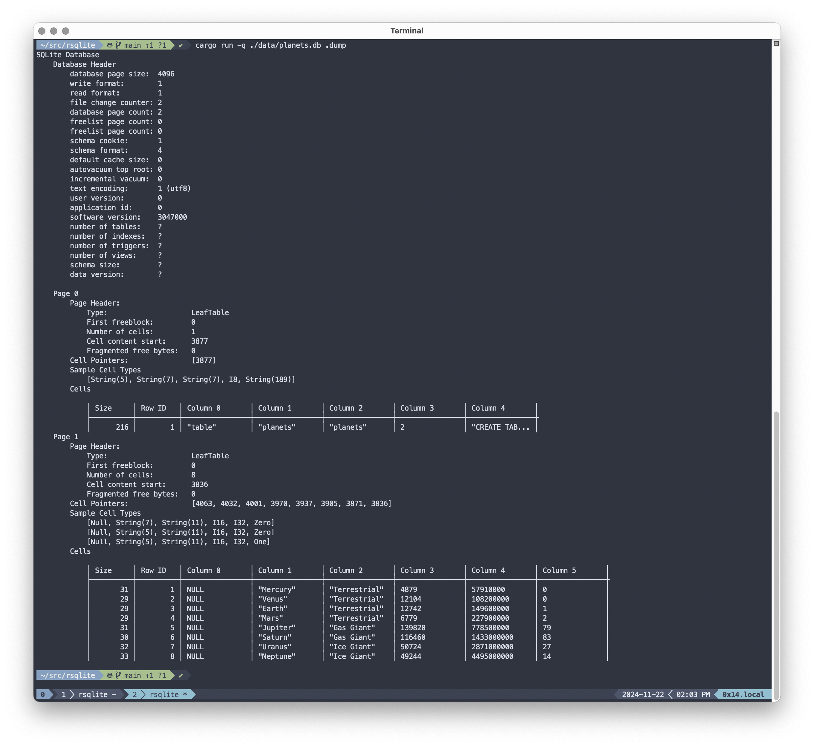

## 🌤️ A very naive SQLite database reader.


### 🪴 Create test database

```
$ sqlite3 data/planets.db < data/planets.sql
```

### ℹ️ dbinfo

This command tries to mirrors the output of built in `.dbinfo` command.

```

$ sqlite3 data/planets.db .dbinfo

database page size:  4096
write format:        1
...


$ cargo run -q ./data/planets.db .dbinfo

database page size:  4096
write format:        1
read format:         1
...

```

### 🐘 Raw dump of everything else


```
$ cargo run -q ./data/planets.db .dump

SQLite Database
    Database Header
        database page size:  4096
        write format:        1
...
```



